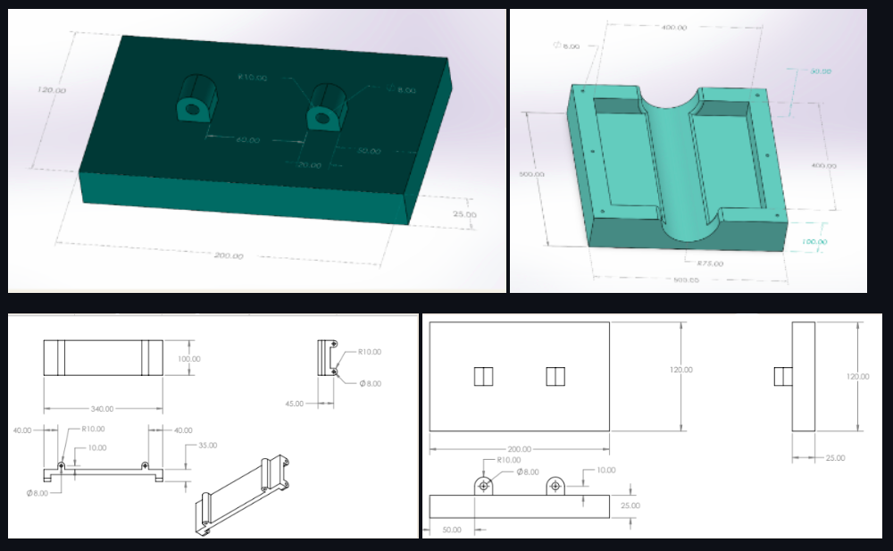
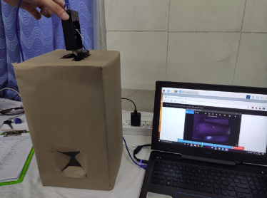
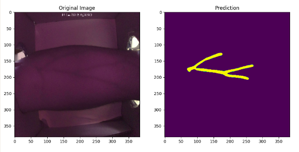
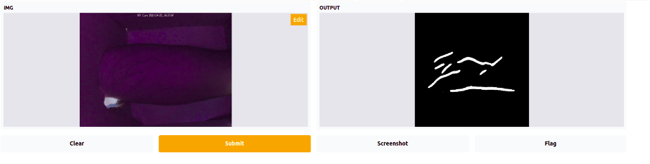

# Blood Extraction Device
  <p align="left">
    
  </p>
  
## Problem Scope 
* Blood extraction device will be able to automatically extract blood without any human assistance.
* The device will be able to detect the veins in a person’s arm by capturing the photo of the arm.
* The ML model will calculate the coordinates of the venipuncture point from where the blood will be extracted.
* The device also includes a syringe load and unload mechanism to change the syringe everytime after performing the extraction process.

## Hardware Structure

* ### Design Diagrams
  <p align="left">
    
  </p>


* ## Image Capturing Mechanism  
  <p align="left">
    
  </p>


## Setup  
  * To use the pickled model for inference, download the model weights from [link](https://drive.google.com/file/d/11wMm9ecgAKAZYJzM733wGRrjnlhHqHQp/view?usp=sharing)
  * Place the pickled model in the directory 
  
 ## To use CLI
 
 ```console
foo@bar:~$ git clone https://github.com/namantuli18/Vein_Segmentation
Cloning into 'Vein_Segmentation'...
remote: Enumerating objects: 2787, done.
remote: Counting objects: 100% (711/711), done.
remote: Compressing objects: 100% (447/447), done.
remote: Total 2787 (delta 395), reused 544 (delta 255), pack-reused 2076
Receiving objects: 100% (2787/2787), 200.13 MiB | 2.95 MiB/s, done.
Resolving deltas: 100% (652/652), done.
Updating files: 100% (2096/2096), done.
foo@bar:~$ python3 inference.py --img veins.jpg
2021-08-01 13:42:27.386508: I tensorflow/core/platform/profile_utils/cpu_utils.cc:112] CPU Frequency: 1800000000 Hz

```

### Output Image
<p align="left">
    
  </p>

## To use GUI

```console
foo@bar:~$ git clone https://github.com/namantuli18/Vein_Segmentation
Cloning into 'Vein_Segmentation'...
remote: Enumerating objects: 2787, done.
remote: Counting objects: 100% (711/711), done.
remote: Compressing objects: 100% (447/447), done.
remote: Total 2787 (delta 395), reused 544 (delta 255), pack-reused 2076
Receiving objects: 100% (2787/2787), 200.13 MiB | 2.95 MiB/s, done.
Resolving deltas: 100% (652/652), done.
Updating files: 100% (2096/2096), done.
foo@bar:~$ python3 interface.py
Running locally at: http://127.0.0.1:7860/
This share link will expire in 24 hours. If you need a permanent link, visit: https://gradio.app/introducing-hosted (NEW!
2021-08-01 13:42:27.386508: I tensorflow/core/platform/profile_utils/cpu_utils.cc:112] CPU Frequency: 1800000000 Hz
```

### Output Image
<p align="left">
    
  </p>
